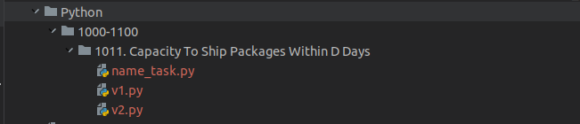
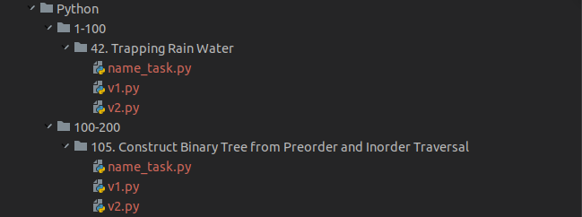

# LeetCode Parser for create directories and files with data

Installation
------------

#### Clone a repository

```
git clone https://github.com/vadushkin/LeetCodeParser.git
```

#### Change a folder

```
cd LeetCodeParser
```

#### Venv

Windows:

```shell
python -m venv venv
.\venv\Scripts\activate
pip install --upgrade pip
pip install -r requirements.txt
```

Linux:

```shell
python3 -m venv venv
source venv/bin/activate
pip3 install --upgrade pip
pip3 install -r requirements.txt
```

#### Poetry

```
poetry install
poetry shell
```

#### Create ```.env``` file or delete ```.example``` from ```.env.example```

#### Example to fill in

```dotenv
ABSOLUTE_PATH="Your absolute path"
YOUR_FAVORITE_LANGUAGE=Python3
```

Examples
---------

### You can add a daily task

```shell
python main.py
```



```name_task.py```:

```python
"""
A conveyor belt has packages that must be shipped from
The ith package on the conveyor belt has a weight
of weights[i]. Each day, we load the ship with packages
on the conveyor belt (in the order given by weights).
We may not load more weight than the maximum weight
Return the least weight capacity of the ship that will
result in all the packages on the conveyor belt being

* Example 1:
Input: weights = [1,2,3,4,5,6,7,8,9,10], days = 5
Output: 15
Explanation: A ship capacity of 15 is the minimum to ship all the packages in 5 days like this:
1st day: 1, 2, 3, 4, 5
2nd day: 6, 7
3rd day: 8
4th day: 9
5th day: 10

Note that the cargo must be shipped in the order given, so using a ship of capacity 14 and splitting the packages into parts like (2, 3, 4, 5), (1, 6, 7), (8), (9), (10) is not allowed.

* Example 2:
Input: weights = [3,2,2,4,1,4], days = 3
Output: 6
Explanation: A ship capacity of 6 is the minimum to ship all the packages in 3 days like this:
1st day: 3, 2
2nd day: 2, 4
3rd day: 1, 4

* Example 3:
Input: weights = [1,2,3,1,1], days = 4
Output: 3
Explanation:
1st day: 1
2nd day: 2
3rd day: 3
4th day: 1, 1

Constraints:

* 1 <= days <= weights.length <= 5 * 104
* 1 <= weights[i] <= 500
"""
```

```v1.py```:

```python
class Solution:
    def shipWithinDays(self, weights: List[int], days: int) -> int:
        pass


def main():
    s = Solution()
    print(s.shipWithinDays([1, 2, 3, 4, 5, 6, 7, 8, 9, 10], 5))


if __name__ == '__main__':
    main()

"""Tests:
1. 

2. 
"""
```

### You can add several tasks at once

```shell
python main.py 105 42
```



### I also left the examples that turned out Python folder

Improvements
------------

* You can add imports of List, Optional and others, if there are any
* Instead of imports, you can change the capital letter to a small one (After Python 3.10)
* Add an implementation of sql and bash tasks
* You can also add all the languages from LeetCode and a small implementation for them
* If you add an implementation for different languages, you can divide the logic into classes and change the code a
  little

Idea
----

Thanks for template: [Hehwiqn](https://github.com/BenitoSwaggolini)

Original script: [Leetcode-daily-task-auto-folder](https://github.com/BenitoSwaggolini/Leetcode-daily-task-auto-folder)
